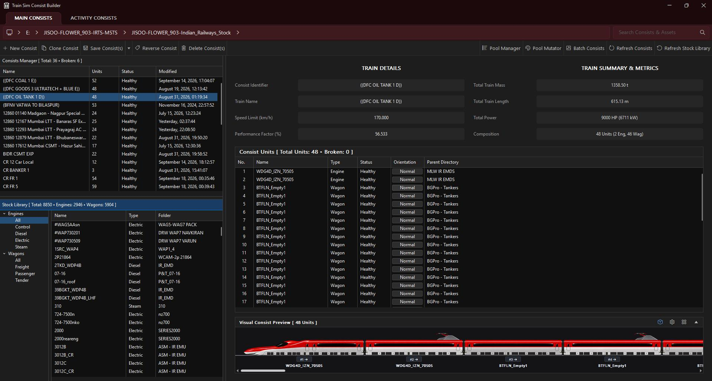
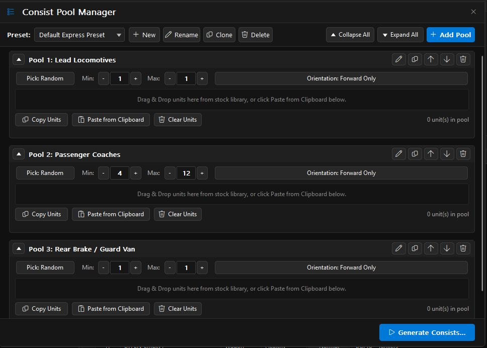
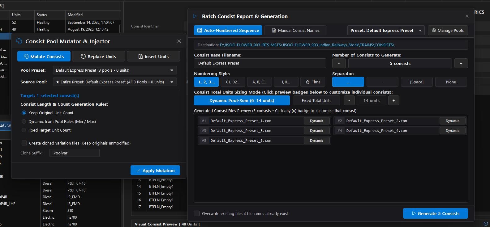

# Train Sim Consist Builder for Open Rails (v6.0.0)

A high-performance, native Win32/C++ consist and activity editor designed for **Open Rails (ORTS)**. Built as a free, lightweight, open-source utility, this application delivers instant library indexing, real-time metrics calculations, and complete file-explorer-style control over rolling stock assets.

---

## Workspace Overview

The main workspace is structured into a dark-themed, dual-pane layout designed for maximum efficiency when managing large Open Rails installations.

### 1. Top Navigation & Directory Bar
* **Main Consists / Activity Consists Tabs:** Toggle instantly between standalone `.con` consist files and route-specific activity consist structures.
* **Breadcrumb Path Navigator:** Direct breadcrumb path view allowing instant navigation across custom installation directories and train directories.
* **Global Search Bar:** Filter consists, engines, and wagons on the fly across your entire stock library.
* **Action Toolbar:** One-click shortcuts for creating new consists, cloning, saving, reversing unit order, deleting, and triggering the **Pool Manager**, **Pool Mutator**, and **Batch Consist Generator**.

---

### 2. Left Explorer Panes
* **Consists Manager Panel:** Lists all detected consist files alongside unit counts, health status (*Healthy* vs. *Broken/Missing units*), and last modified dates.
* **Stock Library Tree:** Categorized tree view splitting your installed rolling stock into **Engines** (*Diesel, Electric, Steam, Control*) and **Wagons** (*Freight, Passenger, Tender*) for fast dragging and dropping.

---

### 3. Center Consist Inspector & Metrics Panel
* **Train Details:** View and edit core consist metadata including *Consist Identifier*, *Train Name*, *Max Speed Limit (km/h)*, and *Performance Factor (%)*.
* **Train Summary & Metrics:** Live automated calculations for:
  * **Total Train Mass:** Expressed in metric tonnes ($t$).
  * **Total Train Length:** Live physical length calculation ($m$).
  * **Total Power:** Combined horsepower and mechanical output ($HP / kW$).
  * **Composition Breakdown:** Itemized unit breakdown (e.g., *48 Units: 2 Eng, 46 Wag*).

---

### 4. Unit Operations & Visual Canvas
* **Consist Units Table:** Granular list displaying unit position number, asset name, type (*Engine/Wagon*), operational status, orientation (*Normal/Flipped*), and source parent directory.
* **Visual Consist Preview Canvas:** Interactive graphical render showing real-time unit alignment, direction arrows, unit names, and live flipping controls directly on the canvas.

---
### 5. Consist Pool Manager
The Consist Pool Manager provides a rule-based system for building and managing modular rolling stock rules to power automated consist creation.

* **Preset Management Toolbar:** 
  * Select, create (`+ New`), rename, clone, or delete preset configurations (e.g., *Default Express Preset*).
  * Global card controls allowing you to `Collapse All` or `Expand All` pool sections, or insert a new group via `+ Add Pool`.
* **Collapsible Pool Cards:** 
  * Reorder pool cards using up/down arrows ($\uparrow$/$\downarrow$), edit titles, clone cards, or delete individual pool groups.
  * Drag and drop rolling stock directly from the Stock Library into target pools, or use the in-place `Copy Units`, `Paste from Clipboard`, and `Clear Units` actions.
* **Fine-Grained Sizing & Picking Rules:**
  * **Pick Mode:** Toggle selection logic between *Random* and *Sequential* picking.
  * **Min / Max Unit Limits:** Enforce exact or variable unit counts per pool (e.g., Min: 4, Max: 12 coaches).
  * **Orientation Policy:** Enforce unit alignment rules (*Forward Only*, *Flipped Only*, or *Mixed/Random*).
* **Direct Generation Trigger:** Launch the automated generator directly using the `Generate Consists...` action button.

---

### 6. Consist Pool Mutator & Batch Generator

The application includes two advanced tools for rapid consist transformation and bulk generation.

#### A. Consist Pool Mutator & Injector
Transform existing consist files without rebuilding them manually:
* **Operation Modes:**
  * **Mutate Consists:** Re-rolls rolling stock inside selected consists based on active pool rules while maintaining the overall train structure.
  * **Replace Units:** Target specific unit types (e.g., replacing locos or older coaches) across multiple consists simultaneously.
  * **Insert Units:** Inject helper bankers, extra coaches, or inspection cars at the front, middle, or rear positions.
* **Pool & Target Selection:** Choose specific **Pool Presets** and target entire presets or individual source pools.
* **Consist Length & Count Rules:**
  * *Keep Original Unit Count:* Retains exact unit numbers while swapping stock.
  * *Dynamic from Pool Rules (Min / Max):* Adjusts total length dynamically based on min/max pool constraints.
  * *Fixed Target Unit Count:* Forces selected consists to a uniform unit length.
* **Non-Destructive Clones:** Option to create cloned variation files (`_PoolVar` suffix) to preserve original `.con` files.

#### B. Batch Consist Export & Generation
Instantly generate dozens of realistic consists in seconds using configured pool presets:
* **Naming & Sequence Control:**
  * Choose between **Auto-Numbered Sequence** or **Manual Consist Names**.
  * Configurable **Numbering Styles** (`1, 2, 3...`, `01, 02...`, Roman numerals, timestamp) and custom separators (`_`, `-`, space, or none).
* **Consist Sizing Modes:**
  * **Dynamic Pool-Sum:** Calculates variable consist lengths dynamically based on pool min/max constraints.
  * **Fixed Total Units:** Enforces a precise total length across all generated consists.
* **Interactive File Preview:** Live grid showing generated `.con` filenames with individual length badges that can be clicked to customize unit rules per consist.
* **Safety Option:** Toggle `Overwrite existing files if filenames already exist` to prevent accidental file loss.

## Installation & Running

1. Download `TrainSimConsistBuilder_v6.0.0_x64.exe` or `TrainSimConsistBuilder_v6.0.0_x32.exe` from the **Releases** tab as per your PC configuartion.
2. Run the downloaded exe —no installation, runtimes, or external frameworks required.

---

## License

Distributed under the **GNU General Public License v3.0 (GPLv3)**. Free and open-source forever.